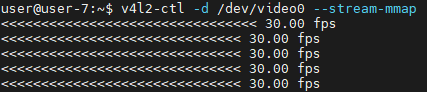

## Description

This document details the steps to validate ACPI-enumerated GMSL sensors, providing essential information for system integration.

For Kernel space ASL source file creation and compilation, please refer to [kernelspace.md](./kernelspace.md).

## Construct pipeline using mc-setup.sh

Instead of using XML or JSON file to describe the media-ctl pipeline, and let libcamhal to perform the configuration, mc-setup script is provided to directly construct media-ctl pipeline based on the current ACPI enumeration based on ASL source file. This way, libcamhal config files (xml or json) can be generic without the naming and topology dependency, and can be reused for different hardware setup as long as mc-setup is maintained properly and extended when there is new hardware or configuration need.

Currently mc-setup only supports d4xx and isx031 GMSL sensors, max9295a serializer, max96724 and max9296 deserializer. Feel free to extend mc-setup.sh for other sensors or different use case based on current implementation. The script is located in ../../script/acpi/mc-setup.sh. Please refer to the script for more details of the implementation and usage. Below sections describe how to construct media-ctl pipeline for 2D YUV sensors and 3D sensors, and how to verify the streaming of sensors.

Provided that ACPI enumeration is successful, just run below command to construct media-ctl pipeline for all available links on all available deserializers.

    ../../script/acpi/mc-setup.sh

### Construct pipeline for 2D YUV sensors

| Use Case | Sample command |
| --- | --- |
| all streams on all available links on all available DES | ../../script/acpi/mc-setup.sh |
| all streams on all available links on particular DES | DES_BUSADDR=2-0027 ../../script/acpi/mc-setup.sh |
| single stream on single link on DES0 | ../../script/acpi/mc-setup.sh des=0,link=0,stream=yuv |

### Construct pipeline for 3D sensors

| Use Case | Sample command |
|--- | --- |
| Depth+RGB on all available links on all available DES | ../../script/acpi/mc-setup.sh |
| Depth+RGB on all available links on particular DES | DES_BUSADDR=2-0027 ../../script/acpi/mc-setup.sh |
| Depth+RGB on single link on DES0 | ../../script/acpi/mc-setup.sh des=0,link=0,stream=depth,rgb |
| all streams on single link on DES0 | ../../script/acpi/mc-setup.sh des=0,link=0,stream=depth,rgb,ir,imu |
| 2x RGB streams on link0,link1 on DES0 | ../../script/acpi/mc-setup.sh des=0,link=0,stream=rgb des=0,link=1,stream=rgb |
| 4x RGB stream on link0,link1 on DES0,DES1 | ../../script/acpi/mc-setup.sh des=0,link=0,stream=rgb des=0,link=1,stream=rgb des=1,link=0,stream=rgb des=1,link=1,stream=rgb |

>**Note:** MAX96724 only supports 4 active routing (matching with 4 internal pipes) at the same time, so maximum only 4 streams can be enabled on each DES, and by default it is 2 streams (Depth+RGB) from each D457 (assuming 2x D457 connected on each DES).

Below is the sample output of mc-setup.sh for 2x D457 sensors on DES0, 2x D457 sensors on DES1.
From there it shows that which stream from the sensor can be captured from which /dev/videoX node, which user can get the frames using v4l2-ctl, v4l2src, icamerasrc or any other v4l2 compatible application.

## Sensor stream verification

### Sanity Streaming Test using v4l2-ctl

>Pro: v4l2-ctl can be used directly once mc-setup is completed; it is also more lightweight than v4l2src since it does not require GStreamer.

>Con: no preview window; it only shows streaming status in terminal.

#### Sample Command for v4l2-ctl

v4l2-ctl -d /dev/video{X} --stream-mmap

You should see something like  in terminal, which means the stream is working properly.

### Gstreamer streaming using v4l2src

>Pro: v4l2src can directly be used once mc-setup is completed without any libcamhal configuration files setup.

>Con: v4l2src does not support DMABuf which might hit some performance issue.

#### Sample Command for v4l2src

| Sensor | Link Number  | Command Pipeline |
| --- | --- | --- |
| isx031 | des0 link 0 | gst-launch-1.0 v4l2src device=/dev/video0 ! 'video/x-raw,format=UYVY,width=1920,height=1536,framerate=30/1,pixel-aspect-ratio=1/1' ! glimagesink |
| isx031 | des0 link 1 | gst-launch-1.0 v4l2src device=/dev/video1 ! 'video/x-raw,format=UYVY,width=1920,height=1536,framerate=30/1,pixel-aspect-ratio=1/1' ! glimagesink |
| d457 depth | des0 link 0 | gst-launch-1.0 v4l2src device=/dev/video0 ! 'video/x-raw,format=UYVY,width=640,height=480,framerate=30/1,pixel-aspect-ratio=1/1' ! glimagesink |
| d457 depth | des0 link 1 | gst-launch-1.0 v4l2src device=/dev/video1 ! 'video/x-raw,format=UYVY,width=640,height=480,framerate=30/1,pixel-aspect-ratio=1/1' ! glimagesink |
| d457 rgb | des0 link 0 | gst-launch-1.0 v4l2src device=/dev/video4 ! 'video/x-raw,format=YUY2,width=640,height=480,framerate=30/1,pixel-aspect-ratio=1/1' ! glimagesink |
| d457 rgb | des0 link 1 | gst-launch-1.0 v4l2src device=/dev/video5 ! 'video/x-raw,format=YUY2,width=640,height=480,framerate=30/1,pixel-aspect-ratio=1/1' ! glimagesink |

### Gstreamer streaming using icamerasrc

>Pro: icamerasrc support DMABuf which can have better performance.

>Con: Have dependency on [ipu7-camera-hal PR44](https://github.com/intel/ipu7-camera-hal/pull/44)

Pre-requisite:

>**ipu7-camera-hal already cloned and compiled previously**

    cd ipu7-camera-hal
    git fetch origin pull/44/head:pr-44
    git checkout pr-44

**Rebuild and Reinstall** ipu7-camera-hal

Export environment variables below

    unset XDG_RUNTIME_DIR
    export DISPLAY=:0; xhost +
    export GST_PLUGIN_PATH=/usr/lib/gstreamer-1.0
    export LIBVA_DRIVER_NAME=iHD
    export GST_GL_API=gles2
    export GST_GL_PLATFORM=egl
    export LIBVA_DRIVERS_PATH=/usr/lib/x86_64-linux-gnu/dri
    export PKG_CONFIG_PATH=/usr/local/lib/pkgconfig:/usr/lib64/pkgconfig:/usr/lib/pkgconfig
    export LD_LIBRARY_PATH=/usr/local/lib/pkgconfig:/usr/local/lib:/usr/lib64:/usr/lib:/usr/lib/x86_64-linux-gnu
    export logSink=terminal
    rm -rf ~/.cache/gstreamer-1.0

#### Sample Command for icamerasrc

The list below keeps track of the validated sensor and their respective configuration for icamerasrc.
3D sensors require separate config file, and can be found in their respective directories, i.e. d4xx sensor config file is located in ../../config/d4xx/ .

| Sensor | drm-format | width | height |
| --- | --- | --- | --- |
| isx031 | UYVY | 1920 | 1536 |

Replace the drm-format, width, height in the command pipeline below based on the supported sensor configuration above.

| Link Number | Sample Command Pipeline |
| --- | --- |
| link 0 | gst-launch-1.0 icamerasrc num-buffers=-1 num-vc=1 scene-mode=normal device-name=acpi-1 printfps=true io-mode=dma_mode ! 'video/x-raw(memory:DMABuf),drm-format=UYVY,width=1920,height=1536' ! glimagesink sync=false |
| link 1 | gst-launch-1.0 icamerasrc num-buffers=-1 num-vc=1 scene-mode=normal device-name=acpi-2 printfps=true io-mode=dma_mode ! 'video/x-raw(memory:DMABuf),drm-format=UYVY,width=1920,height=1536' ! glimagesink sync=false |
| link 2 | gst-launch-1.0 icamerasrc num-buffers=-1 num-vc=1 scene-mode=normal device-name=acpi-3 printfps=true io-mode=dma_mode ! 'video/x-raw(memory:DMABuf),drm-format=UYVY,width=1920,height=1536' ! glimagesink sync=false |
| link 3 | gst-launch-1.0 icamerasrc num-buffers=-1 num-vc=1 scene-mode=normal device-name=acpi-4 printfps=true io-mode=dma_mode ! 'video/x-raw(memory:DMABuf),drm-format=UYVY,width=1920,height=1536' ! glimagesink sync=false |
| link 4 | gst-launch-1.0 icamerasrc num-buffers=-1 num-vc=1 scene-mode=normal device-name=acpi-5 printfps=true io-mode=dma_mode ! 'video/x-raw(memory:DMABuf),drm-format=UYVY,width=1920,height=1536' ! glimagesink sync=false |
| link 5 | gst-launch-1.0 icamerasrc num-buffers=-1 num-vc=1 scene-mode=normal device-name=acpi-6 printfps=true io-mode=dma_mode ! 'video/x-raw(memory:DMABuf),drm-format=UYVY,width=1920,height=1536' ! glimagesink sync=false |
| link 6 | gst-launch-1.0 icamerasrc num-buffers=-1 num-vc=1 scene-mode=normal device-name=acpi-7 printfps=true io-mode=dma_mode ! 'video/x-raw(memory:DMABuf),drm-format=UYVY,width=1920,height=1536' ! glimagesink sync=false |
| link 7 | gst-launch-1.0 icamerasrc num-buffers=-1 num-vc=1 scene-mode=normal device-name=acpi-8 printfps=true io-mode=dma_mode ! 'video/x-raw(memory:DMABuf),drm-format=UYVY,width=1920,height=1536' ! glimagesink sync=false |

