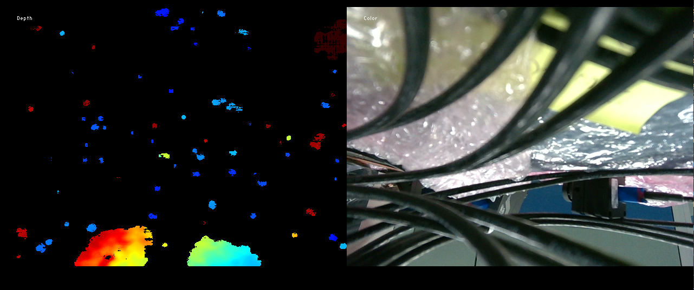

## Description

This document provides details of the configuration settings for the D457 GMSL sensor using maxim-serdes driver.

>**Note:** Before going through this document, please make sure you have gone through [../acpi/kernelspace.md](../acpi/kernelspace.md) and [../acpi/userspace-gmsl.md](../acpi/userspace-gmsl.md) to understand the ACPI enumeration and userspace configuration for GMSL sensors.

## Compile ACPI ASL file based on use case

### SSDT for 2x + 2x D457 on MAX96724 for IPU75XA

Currently we only provide [SSDT](../../acpi/ipu7/max96724_rs_d457.asl) for 2x + 2x D457 use case on MAX96724 for IPU75XA. If you want to have different connection, please modify the SSDT before compiling.

>**Note:** MAX96724 only has 4 pipes, and for now only legacy mode is supported, which means only 4 streams can be streamed at the same time per deserializer. This is why we only provide SSDT for 2x on each DES use case.

> Follow [This section in ../acpi/kernelspace.md](../acpi/kernelspace.md#compile-and-load-acpi-asl-source-on-canonical-ubuntu-2404-or-2604) to compile and load the ASL source file into kernel.

## Configure pipeline using mc-setup.sh

Run `../../script/acpi/mc-setup.sh` or refer to [Configure pipeline for 3D sensors](../acpi/userspace-gmsl.md#construct-pipeline-for-3d-sensors) for configuring the streams separately.

After configuring the pipeline, it is recommended to run [sanity streaming test using v4l2-ctl](./userspace-gmsl.md#sanity-streaming-test-using-v4l2-ctl) on each node based on the output of mc-setup.sh.

>**Note:** MAX96724 only supports 4 active routing (matching with 4 internal pipes) at the same time, so maximum only 4 streams can be enabled on each DES, and by default it is 2 streams (Depth+RGB) from each D457 (assuming 2x D457 connected on each DES).

## Sensor Verification

Each of the entity should have their own subdev node. If there is mismatch in the ASL and actual hardware connection (hardware is less, or probe failed), all of the sensor subdev node will not be created and mc-setup script will fail to execute.

Upon Bootup, run `media-ctl -p` command should show 

Upon running mc-setup script, `media-ctl -p` command should show

## Sensor stream verification

### Sanity Streaming Test using v4l2-ctl

Follow [Sanity Streaming Test using v4l2-ctl](../acpi/userspace-gmsl.md#sanity-streaming-test-using-v4l2-ctl) according to mc-setup.sh output.

#### Sample Command for v4l2-ctl

>Note: Please use the respective video node that is shown in the output of mc-setup.sh.

| Stream | Link Number | Command Pipeline                      |
| ---    | ---         | ---                                   |
| depth  | des0 link 0 | v4l2-ctl -d /dev/video0 --stream-mmap |
| depth  | des0 link 1 | v4l2-ctl -d /dev/video1 --stream-mmap |
| rgb    | des0 link 0 | v4l2-ctl -d /dev/video4 --stream-mmap |
| rgb    | des0 link 1 | v4l2-ctl -d /dev/video5 --stream-mmap |

### Gstreamer streaming using v4l2src

Follow [Gstreamer streaming using v4l2src](../acpi/userspace-gmsl.md#gstreamer-streaming-using-v4l2src) according to mc-setup.sh output.

#### Sample Command for v4l2src

>Note: Please use the respective video node that is shown in the output of mc-setup.sh.

| Stream | Link Number | Command Pipeline |
| --- | --- | --- |
| depth  | des0 link 0 | gst-launch-1.0 v4l2src device=/dev/video0 ! 'video/x-raw,format=UYVY,width=640,height=480,framerate=30/1,pixel-aspect-ratio=1/1' ! glimagesink |
| depth  | des0 link 1 | gst-launch-1.0 v4l2src device=/dev/video1 ! 'video/x-raw,format=UYVY,width=640,height=480,framerate=30/1,pixel-aspect-ratio=1/1' ! glimagesink |
| rgb    | des0 link 0 | gst-launch-1.0 v4l2src device=/dev/video4 ! 'video/x-raw,format=YUY2,width=640,height=480,framerate=30/1,pixel-aspect-ratio=1/1' ! glimagesink |
| rgb    | des0 link 1 | gst-launch-1.0 v4l2src device=/dev/video5 ! 'video/x-raw,format=YUY2,width=640,height=480,framerate=30/1,pixel-aspect-ratio=1/1' ! glimagesink |

### Gstreamer streaming using icamerasrc

>Pro: icamerasrc support DMABuf which can have better performance.

>Con: Have dependency on [ipu7-camera-hal PR](https://github.com/intel/ipu7-camera-hal/pull/44)

Follow section [Camera Configuration File Setup for IPU75XA](./userspace-gmsl.md#camera-configuration-file-setup-for-ipu75xa) to setup config file for icamerasrc.

#### Environment Setup

Export environment variables below

    unset XDG_RUNTIME_DIR
    export DISPLAY=:0; xhost +
    export GST_PLUGIN_PATH=/usr/lib/gstreamer-1.0
    export LIBVA_DRIVER_NAME=iHD
    export GST_GL_API=gles2
    export GST_GL_PLATFORM=egl
    export LIBVA_DRIVERS_PATH=/usr/lib/x86_64-linux-gnu/dri
    export PKG_CONFIG_PATH=/usr/local/lib/pkgconfig:/usr/lib64/pkgconfig:/usr/lib/pkgconfig
    export LD_LIBRARY_PATH=/usr/local/lib/pkgconfig:/usr/local/lib:/usr/lib64:/usr/lib:/usr/lib/x86_64-linux-gnu
    export logSink=terminal
    rm -rf ~/.cache/gstreamer-1.0

#### Sample Command for icamerasrc

> Note: Icamerasrc and libcamhal config only enabled RGB stream from a D457 sensor, since only RGB stream is human-viewable frame. The Depth stream requires additional conversion to be meaningful data. Please refer to [Realsense SDK section](./userspace-gmsl.md#verify-stream-using-realsense-sdk) for more details.

##### Sensor Device Selection

| Link Number | Command Pipeline |
|---|---|
| des0 link 0 | gst-launch-1.0 icamerasrc num-buffers=-1 num-vc=1 device-name=d4xx-1 printfps=true io-mode=dma_mode ! 'video/x-raw(memory:DMABuf),drm-format=YUYV,width=640,height=480' ! glimagesink sync=false |
| des0 link 1 | gst-launch-1.0 icamerasrc num-buffers=-1 num-vc=1 device-name=d4xx-2 printfps=true io-mode=dma_mode ! 'video/x-raw(memory:DMABuf),drm-format=YUYV,width=640,height=480' ! glimagesink sync=false |
| des0 link 2 | gst-launch-1.0 icamerasrc num-buffers=-1 num-vc=1 device-name=d4xx-3 printfps=true io-mode=dma_mode ! 'video/x-raw(memory:DMABuf),drm-format=YUYV,width=640,height=480' ! glimagesink sync=false |
| des0 link 3 | gst-launch-1.0 icamerasrc num-buffers=-1 num-vc=1 device-name=d4xx-4 printfps=true io-mode=dma_mode ! 'video/x-raw(memory:DMABuf),drm-format=YUYV,width=640,height=480' ! glimagesink sync=false |
| des1 link 0 | gst-launch-1.0 icamerasrc num-buffers=-1 num-vc=1 device-name=d4xx-5 printfps=true io-mode=dma_mode ! 'video/x-raw(memory:DMABuf),drm-format=YUYV,width=640,height=480' ! glimagesink sync=false |
| des1 link 1 | gst-launch-1.0 icamerasrc num-buffers=-1 num-vc=1 device-name=d4xx-6 printfps=true io-mode=dma_mode ! 'video/x-raw(memory:DMABuf),drm-format=YUYV,width=640,height=480' ! glimagesink sync=false |
| des1 link 2 | gst-launch-1.0 icamerasrc num-buffers=-1 num-vc=1 device-name=d4xx-7 printfps=true io-mode=dma_mode ! 'video/x-raw(memory:DMABuf),drm-format=YUYV,width=640,height=480' ! glimagesink sync=false |
| des1 link 3 | gst-launch-1.0 icamerasrc num-buffers=-1 num-vc=1 device-name=d4xx-8 printfps=true io-mode=dma_mode ! 'video/x-raw(memory:DMABuf),drm-format=YUYV,width=640,height=480' ! glimagesink sync=false |

> **Note**: Refer to icamerasrc device-name property for more sensor details.

###### How to relate Sensor Number with AIC Link Port

| AIC Link Port | Sensor Number |
|---            |---            |
| A             | 1             |
| B             | 2             |
| C             | 3             |
| D             | 4             |

For AIC MAX96724

##### Frame Buffer Memory Type (IO Mode) Selection

| Stream | IO Mode | Command Pipeline |
|---|---|---|
| RGB | MMAP | gst-launch-1.0 icamerasrc num-buffers=-1 num-vc=1 device-name=d4xx-1 printfps=true io-mode=mmap ! 'video/x-raw,format=YUY2,width=640,height=480' ! glimagesink sync=false |
| RGB | DMABUF | gst-launch-1.0 icamerasrc num-buffers=-1 num-vc=1 device-name=d4xx-1 printfps=true io-mode=dma_mode ! 'video/x-raw(memory:DMABuf),drm-format=YUYV,width=640,height=480' ! glimagesink sync=false |

> **Note**: Refer to icamerasrc io-mode property for more sensor details.

##### Sensor Resolution Selection

| Stream| Resolution | Command Pipeline |
| --- | --- | --- |
| RGB | 640x480 | gst-launch-1.0 icamerasrc num-buffers=-1 num-vc=1 device-name=d4xx-1 printfps=true io-mode=dma_mode ! 'video/x-raw(memory:DMABuf),drm-format=YUYV,width=640,height=480' ! glimagesink sync=false |

##### Sensor Format Selection

| Stream | Format | Command Pipeline |
| --- | --- | --- |
| RGB | YUYV | gst-launch-1.0 icamerasrc num-buffers=-1 num-vc=1 device-name=d4xx-1 printfps=true io-mode=dma_mode ! 'video/x-raw(memory:DMABuf),drm-format=YUYV,width=640,height=480' ! glimagesink sync=false |

##### Number of Stream (Single Stream / Multi Stream) Selection

| Stream | Number of Stream | Command Pipeline |
| --- | --- | --- |
| RGB | x1 | gst-launch-1.0 icamerasrc num-buffers=-1 num-vc=1 device-name=d4xx-1 printfps=true io-mode=dma_mode ! 'video/x-raw(memory:DMABuf),drm-format=YUYV,width=640,height=480' ! glimagesink sync=false |
| RGB | x2 | gst-launch-1.0 icamerasrc num-buffers=-1 num-vc=2 device-name=d4xx-1 printfps=true io-mode=dma_mode ! 'video/x-raw(memory:DMABuf),drm-format=YUYV,width=640,height=480' ! glimagesink sync=false icamerasrc num-buffers=-1 num-vc=2 device-name=d4xx-2 printfps=true io-mode=dma_mode ! 'video/x-raw(memory:DMABuf),drm-format=YUYV,width=640,height=480' ! glimagesink sync=false |
| RGB | x4 (x2 + x2) | gst-launch-1.0 icamerasrc num-buffers=-1 num-vc=4 device-name=d4xx-1 printfps=true io-mode=dma_mode ! 'video/x-raw(memory:DMABuf),drm-format=YUYV,width=640,height=480' ! glimagesink sync=false icamerasrc num-buffers=-1 num-vc=4 device-name=d4xx-2 printfps=true io-mode=dma_mode ! 'video/x-raw(memory:DMABuf),drm-format=YUYV,width=640,height=480' ! glimagesink sync=false icamerasrc num-buffers=-1 num-vc=4 device-name=d4xx-5 printfps=true io-mode=dma_mode ! 'video/x-raw(memory:DMABuf),drm-format=YUYV,width=640,height=480' ! glimagesink sync=false icamerasrc num-buffers=-1 num-vc=4 device-name=d4xx-6 printfps=true io-mode=dma_mode ! 'video/x-raw(memory:DMABuf),drm-format=YUYV,width=640,height=480' ! glimagesink sync=false |

### Verify stream using RealSense SDK

Pre-requisite:

-Completed [Pipeline Configuration](./userspace-gmsl.md#configure-pipeline-using-mc-setupsh)

-Completed [Symlinks Creation](./userspace-gmsl.md#create-symlinks-using-upstream-rs-enumsh)

-Completed [librealsense SDK compilation](./userspace-gmsl.md#compile-librealsense-sdk-from-source)

#### Create symlinks using upstream-rs-enum.sh

>**Note:** This step is only necessary to stream with RealSense SDK. If you are using v4l2src or v4l2-ctl, you can skip this step and use the video device directly.

By running the script below, it creates symlinks for video devices that will be used for streaming with RealSense SDK. Symlink that is created will need to be used with librealsense PR [#15007](https://github.com/IntelRealSense/librealsense/pull/15007).

    sudo ../../script/d4xx/upstream-rs-enum.sh

##### Sample Video Node Symlink

The symlink for capture node should be the same as the output of mc-setup.sh command. The syntax looks like video-rs-{stream-type}-{index}, and the stream type can be depth, color, ir or imu. The index starts from 0 for link 0 on DES0, then incremented by 1 for link 1, link 2 and link 3.

For example, if Depth and RGB stream from Link 0 on DES0 are enabled, the symlink for Depth stream will be video-rs-depth-0 and the symlink for RGB stream will be video-rs-color-0, and both of them will point to the corresponding video node allocated by kernel.

| Sample Capture Node       | Sample symlink                               |
| ---                       | ---                                          |
| Intel IPU7 ISYS Capture 0 | video-rs-depth-0 -> /dev/video0              |
| Intel IPU7 ISYS Capture 1 | video-rs-color-0 -> /dev/video4              |

##### Sample Subdev Symlink

The subdev symlink is created with syntax video-rs-{stream-type}-sd-{index}, and the stream type and index follow the same rule as capture node symlink, except that it is pointing to the subdev node instead of video capture node. The subdev node is used for configuration of the sensor, and it is required to be used with librealsense PR [#15007](https://github.com/IntelRealSense/librealsense/pull/15007).

| Sample Entity      | Sample symlink                                |
| ---                | ---                                           |
| D4XX depth 19-0010 | /dev/video-rs-depth-sd-0 -> /dev/v4l-subdev10 |
| D4XX ir 19-0010    | /dev/video-rs-ir-sd-0 -> /dev/v4l-subdev11    |
| D4XX rgb 19-0010   | /dev/video-rs-color-sd-0 -> /dev/v4l-subdev12 |
| D4XX imu 19-0010   | /dev/video-rs-imu-sd-0 -> /dev/v4l-subdev13   |

#### Compile librealsense SDK from source

There are changes in SDK to support Intel IPU that is currently in review.

    git clone https://github.com/realsenseai/librealsense.git
    cd librealsense
    git fetch origin pull/15007/head:pr-15007
    git checkout pr-15007
    mkdir build && cd build
    cmake .. -DCMAKE_BUILD_TYPE=Release -DCMAKE_INSTALL_PREFIX=/usr/local
    make -j2
    cd Release

#### Sample Tools from Realsense SDK

Verify stream using realsense-viewer (output in graphical interface).

    ./realsense-viewer

Sample Output as shown below

Verify multiple streams using rs-multicam (output in graphical interface)

    ./rs-multicam

Sample Output as shown below

Verify single Depth Stream using rs-depth (only Terminal output)

    ./rs-depth

Sample Output as shown below

Verify single Color Stream using rs-color (only Terminal output)

    ./rs-color

Sample Output as shown below

## Known Issue

1. RGB stream can only be streamed one time if no Depth stream is configured and streamed.
   Workaround: To start RGB stream repetitively, you need to reconfigure pipeline using ../../script/acpi/mc-setup.sh with Depth stream enabled, then you need to start & stop Depth stream first before any stream can work properly.

2. D457 might hit unrecoverable I2C error over long period of read/write. Reboot will not resolve the issue.
   Workaround: Power Cycle the sensor.