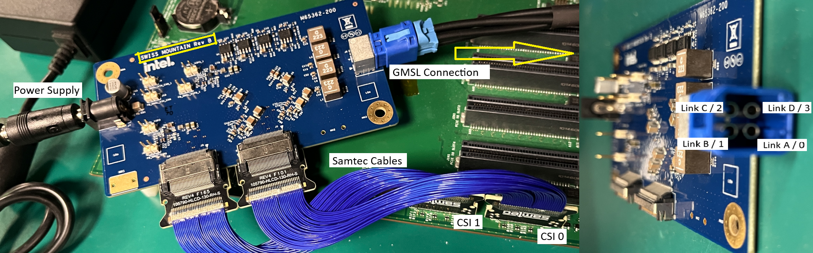
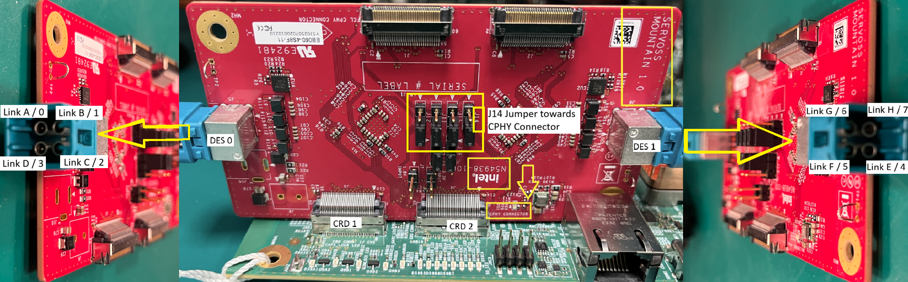
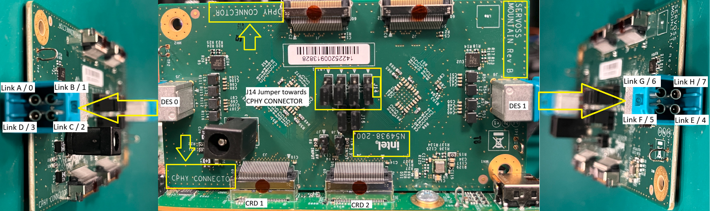
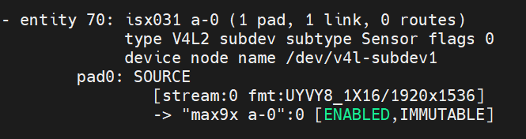

## Description

This document details the configuration settings for the ISX031 GMSL sensor, providing essential information for system integration. The table below presents the key parameters and their respective values used during system setup and validation.

## Table of Contents

- [Hardware Connection](#hardware-connection)
  - [MAX9296 (REV B) Connection](#max9296-rev-b-connection)
  - [MAX96724 AIC (REV A) Connection](#max96724-aic-rev-a-connection)
  - [MAX96724 AIC (D-PHY) (REV B) Connection](#max96724-aic-d-phy-rev-b-connection)
  - [MAX96724 AIC (C-PHY) (REV B) Connection](#max96724-aic-c-phy-rev-b-connection)
  - [MAX96724 AIC (C-PHY to D-PHY Adapter) (REV B) Connection](#max96724-aic-c-phy-to-d-phy-adapter-rev-b-connection)
- [BIOS Configuration Table](#bios-configuration-table)
  - [Disable C States](#disable-c-states)
  - [Sensor ACPI HID](#sensor-acpi-hid)
  - [MIPI Camera Configuration for IPU6EP](#mipi-camera-configuration-for-ipu6ep)
  - [MIPI Camera Configuration for IPU6EPMTL](#mipi-camera-configuration-for-ipu6epmtl)
    - [Connected to MAX9296 AIC](#connected-to-max9296-aic)
    - [Connected to D-PHY of MAX96724 AIC (REV B)](#connected-to-d-phy-of-max96724-aic-rev-b)
  - [MIPI Camera Configuration for IPU75XA](#mipi-camera-configuration-for-ipu75xa)
    - [Connected to C-PHY of MAX96724 AIC (REV B)](#connected-to-c-phy-of-max96724-aic-rev-b)
    - [Connected to D-PHY of MAX96724 AIC (REV B) (via C-to-D-PHY adapter)](#connected-to-d-phy-of-max96724-aic-rev-b-via-c-to-d-phy-adapter)
  - [MIPI Camera Configuration for IPU8](#mipi-camera-configuration-for-ipu8)
    - [Connected to C-PHY of MAX96724 AIC (REV A)](#connected-to-c-phy-of-max96724-aic-rev-a)
- [Camera Configuration File Setup](#camera-configuration-file-setup)
  - [Setup for IPU6EP](#setup-for-ipu6ep)
  - [Setup for IPU6EPMTL](#setup-for-ipu6epmtl)
  - [Setup for IPU75XA](#setup-for-ipu75xa)
- [Environment Setup](#environment-setup)
- [Sensor Verification](#sensor-verification)
- [Sample Userspace Command](#sample-userspace-command)
  - [Sensor Device Selection](#sensor-device-selection)
    - [How to relate Sensor Number with AIC Link Port](#how-to-relate-sensor-number-with-aic-link-port)
  - [Frame Buffer Memory Type (IO Mode) Selection](#frame-buffer-memory-type-io-mode-selection)
  - [Sensor Resolution Selection](#sensor-resolution-selection)
  - [Sensor Format Selection](#sensor-format-selection)
  - [Number of Stream (Single Stream / Multi Stream) Selection](#number-of-stream-single-stream--multi-stream-selection)
- [Streaming Result](#streaming-result)

## Hardware Connection

This section describes the physical AIC (Add-In Card) hardware setup, including link port layout and jumper configurations for MIPI PHY selection.

### MAX9296 (REV B) Connection

> **Note:** Samtec cables and an external power supply are required to connect the MAX9296 AIC to the baseboard.

### MAX96724 AIC (C-PHY) (REV A) Connection

> **Note:** The MAX96724 AIC (REV A) supports only C-PHY connections, selectable via the J14 jumper highlighted in the image below.

### MAX96724 AIC (C-PHY) (REV B) Connection

> **Note:** The MAX96724 AIC (REV B) supports both C-PHY and D-PHY connections, selectable via the J14 jumper.

Image below shows the C-PHY setup.

### MAX96724 AIC (D-PHY) (REV B) Connection

> **Note:** Ensure the J14 jumper pins are oriented toward the D-PHY connector, as shown in the image below.

Image below shows the D-PHY setup.

### MAX96724 AIC (C-PHY to D-PHY Adapter) (REV B) Connection

Image below shows the C-PHY to D-PHY adapter setup.

## BIOS Configuration Table

> **Note:** No External Clock required.

### Disable C States

Config path: `Intel Advanced Menu`->`Power & Performance`->`CPU - Power Management Control`

|                            | Options              |
|---                         |---                   |
| C states                   | Disabled             |

> **Note:** : This option is only applicable for IPU6EP platforms (ADL, TWL, ASL and RPL).

### Sensor ACPI HID

| Vendor                     | Sensor ACPI HID      |
|---                         |---                   |
| D3 Embedded                | INTC031M             |
| Leopard Imaging            | INTC031L             |
| Otobrite                   | INTC031O             |
| Sensing                    | INTC031S             |

> **Note:** Sensor ACPI HID value will be used for `MIPI Camera Configuration`.

### MIPI Camera Configuration for IPU6EP

Config path: `Intel Advanced Menu`->`System Agent (SA) Configuration`->`MIPI Camera Configuration`

Click to expand BIOS camera link options

|                            | Camera1 Link options | Camera2 Link Options |
|---                         |---                   | ---                  |
| Sensor Model               | User Custom          | User Custom          |
| Custom HID                 | <sensor_acpi_hid>    | <sensor_acpi_hid>    |
| Lanes Clock division       | 4 4 2 2              | 4 4 2 2              |
| CRD Version                | CRD-D                | CRD-D                |
| GPIO control               | No Control Logic     | No Control Logic     |
| Camera position            | Front                | Back                 |
| Flash Support              | Disabled             | Disabled             |
| Privacy LED                | Driver default       | Driver default       |
| Rotation                   | 90                   | 90                   |
| PPR Value                  | 2                    | 2                    |
| PPR Unit                   | 2                    | 2                    |
| Camera module name         | _                    | _                    |
| MIPI port                  | 1                    | 2                    |
| LaneUsed                   | x4                   | x4                   |
| PortSpeed                  | 1                    | 2                    |
| MCLK                       | 19200000             | 19200000             |
| EEPROM Type                | ROM_NONE             | ROM_NONE             |
| VCM Type                   | VCM_NONE             | VCM_NONE             |
| Number of I2C Components   | 3                    | 3                    |
| I2C Channel                | I2C1                 | I2C5                 |
| Device 0                   |                      |                      |
| I2C Address                | 48                   | 48                   |
| Device Type                | Sensor               | Sensor               |
| Device 1                   |                      |                      |
| I2C Address                | 44                   | 44                   |
| Device Type                | Sensor               | Sensor               |
| Device 2                   |                      |                      |
| I2C Address                | 50                   | 50                   |
| Device Type                | Sensor               | Sensor               |
| Customize Device ID List   |                      |                      |
| Flash Driver Selection     | Disabled             | Disabled             |

### MIPI Camera Configuration for IPU6EPMTL

Config path: `Intel Advanced Menu`->`System Agent (SA) Configuration`->`MIPI Camera Configuration`

#### Connected to MAX9296 AIC

Click to expand BIOS camera link options

|                            | Camera1 Link options | Camera2 Link Options |
|---                         |---                   | ---                  |
| Sensor Model               | User Custom          | User Custom          |
| Custom HID                 | <sensor_acpi_hid>    | <sensor_acpi_hid>    |
| Lanes Clock division       | 4 4 2 2              | 4 4 2 2              |
| CRD Version                | CRD-D                | CRD-D                |
| GPIO control               | No Control Logic     | No Control Logic     |
| Camera position            | Front                | Back                 |
| Flash Support              | Disabled             | Disabled             |
| Privacy LED                | Driver default       | Driver default       |
| Rotation                   | 90                   | 90                   |
| PPR Value                  | 2                    | 2                    |
| PPR Unit                   | 2                    | 2                    |
| Camera module name         | _                    | _                    |
| MIPI port                  | 0                    | 4                    |
| LaneUsed                   | x4                   | x4                   |
| MCLK                       | 19200000             | 19200000             |
| EEPROM Type                | ROM_NONE             | ROM_NONE             |
| VCM Type                   | VCM_NONE             | VCM_NONE             |
| Number of I2C Components   | 3                    | 3                    |
| I2C Channel                | I2C1                 | I2C0                 |
| Device 0                   |                      |                      |
| I2C Address                | 48                   | 48                   |
| Device Type                | Sensor               | Sensor               |
| Device 1                   |                      |                      |
| I2C Address                | 44                   | 44                   |
| Device Type                | Sensor               | Sensor               |
| Device 2                   |                      |                      |
| I2C Address                | 50                   | 50                   |
| Device Type                | Sensor               | Sensor               |
| Customize Device ID List   |                      |                      |
| Customize Device ID Number | 17                   | 17                   |
| Customize Device ID Number | 18                   | 18                   |
| Customize Device ID Number | 19                   | 19                   |
| Flash Driver Selection     | Disabled             | Disabled             |

#### Connected to D-PHY of MAX96724 AIC (REV B)

> **Note:** Refer to [MAX96724 AIC (D-PHY) (REV B) Connection](#max96724-aic-d-phy-rev-b-connection) for hardware connection and jumper setup.

Click to expand BIOS camera link options

|                            | Camera1 Link options | Camera2 Link Options |
|---                         |---                   | ---                  |
| Sensor Model               | User Custom          | User Custom          |
| Custom HID                 | <sensor_acpi_hid>    | <sensor_acpi_hid>    |
| Lanes Clock division       | 4 4 2 2              | 4 4 2 2              |
| CRD Version                | CRD-D                | CRD-D                |
| GPIO control               | No Control Logic     | No Control Logic     |
| Camera position            | Front                | Back                 |
| Flash Support              | Disabled             | Disabled             |
| Privacy LED                | Driver default       | Driver default       |
| Rotation                   | 90                   | 180                  |
| PPR Value                  | 4                    | 4                    |
| PPR Unit                   | 4                    | 4                    |
| Camera module name         | _                    | _                    |
| MIPI port                  | 0                    | 4                    |
| LaneUsed                   | x4                   | x4                   |
| MCLK                       | 19200000             | 19200000             |
| EEPROM Type                | ROM_NONE             | ROM_NONE             |
| VCM Type                   | VCM_NONE             | VCM_NONE             |
| Number of I2C Components   | 3                    | 3                    |
| I2C Channel                | I2C1                 | I2C0                 |
| Device 0                   |                      |                      |
| I2C Address                | 27                   | 27                   |
| Device Type                | Sensor               | Sensor               |
| Device 1                   |                      |                      |
| I2C Address                | 44                   | 44                   |
| Device Type                | Sensor               | Sensor               |
| Device 2                   |                      |                      |
| I2C Address                | 50                   | 50                   |
| Device Type                | Sensor               | Sensor               |
| Customize Device ID List   |                      |                      |
| Customize Device ID Number | 17                   | 17                   |
| Customize Device ID Number | 18                   | 18                   |
| Customize Device ID Number | 19                   | 19                   |
| Flash Driver Selection     | Disabled             | Disabled             |

### MIPI Camera Configuration for IPU75XA

Config path: `Intel Advanced Menu`->`System Agent (SA) Configuration`->`MIPI Camera Configuration`

#### Connected to C-PHY of MAX96724 AIC (REV B)

> **Note:** Refer to [MAX96724 AIC (C-PHY) (REV B) Connection](#max96724-aic-c-phy-rev-b-connection) for hardware connection and jumper setup.

Click to expand BIOS camera link options

|                            | Camera1 Link options | Camera2 Link Options |
|---                         |---                   | ---                  |
| Sensor Model               | User Custom          | User Custom          |
| Custom HID                 | <sensor_acpi_hid>    | <sensor_acpi_hid>    |
| Lanes Clock division       | 4 4 2 2              | 4 4 2 2              |
| CRD Version                | CRD-D                | CRD-D                |
| GPIO control               | No Control Logic     | No Control Logic     |
| Camera position            | Front                | Back                 |
| Flash Support              | Disabled             | Disabled             |
| Privacy LED                | Driver default       | Driver default       |
| Rotation                   | 180                  | 0                    |
| Voltage Rail               |                      | 3 voltage rail       |
| PhyConfiguration           | CPHY                 | CPHY                 |
| PPR Value                  | 2                    | 2                    |
| PPR Unit                   | 4                    | 4                    |
| Camera module name         | _                    | _                    |
| MIPI port                  | 0                    | 2                    |
| LaneUsed                   | x4                   | x4                   |
| MCLK                       | 19200000             | 19200000             |
| EEPROM Type                | ROM_NONE             | ROM_NONE             |
| VCM Type                   | VCM_NONE             | VCM_NONE             |
| Number of I2C Components   | 3                    | 3                    |
| I2C Channel                | I2C1                 | I2C2                 |
| Device 0                   |                      |                      |
| I2C Address                | 27                   | 27                   |
| Device Type                | Sensor               | Sensor               |
| Device 1                   |                      |                      |
| I2C Address                | 44                   | 44                   |
| Device Type                | Sensor               | Sensor               |
| Device 2                   |                      |                      |
| I2C Address                | 54                   | 54                   |
| Device Type                | Sensor               | Sensor               |
| Customize Device ID List   |                      |                      |
| Customize Device ID Number | 17                   | 17                   |
| Customize Device ID Number | 18                   | 18                   |
| Customize Device ID Number | 19                   | 19                   |
| Flash Driver Selection     | Disabled             | Disabled             |

#### Connected to D-PHY of MAX96724 AIC (REV B) (via C-to-D-PHY adapter)

> **Note:** Refer to [MAX96724 AIC (C-PHY to D-PHY Adapter) (REV B) Connection](#max96724-aic-c-phy-to-d-phy-adapter-rev-b-connection) for hardware connection and jumper setup.

Click to expand BIOS camera link options

|                            | Camera1 Link options | Camera2 Link Options |
|---                         |---                   | ---                  |
| Sensor Model               | User Custom          | User Custom          |
| Custom HID                 | <sensor_acpi_hid>    | <sensor_acpi_hid>    |
| Lanes Clock division       | 4 4 2 2              | 4 4 2 2              |
| CRD Version                | CRD-D                | CRD-D                |
| GPIO control               | No Control Logic     | No Control Logic     |
| Camera position            | Front                | Back                 |
| Flash Support              | Disabled             | Disabled             |
| Privacy LED                | Driver default       | Driver default       |
| Rotation                   | 180                  | 0                    |
| Voltage Rail               |                      | 3 voltage rail       |
| PhyConfiguration           | DPHY                 | DPHY                 |
| PPR Value                  | 4                    | 2                    |
| PPR Unit                   | 4                    | 4                    |
| Camera module name         | _                    | _                    |
| MIPI port                  | 0                    | 2                    |
| LaneUsed                   | x4                   | x4                   |
| MCLK                       | 19200000             | 19200000             |
| EEPROM Type                | ROM_NONE             | ROM_NONE             |
| VCM Type                   | VCM_NONE             | VCM_NONE             |
| Number of I2C Components   | 3                    | 3                    |
| I2C Channel                | I2C1                 | I2C2                 |
| Device 0                   |                      |                      |
| I2C Address                | 27                   | 27                   |
| Device Type                | Sensor               | Sensor               |
| Device 1                   |                      |                      |
| I2C Address                | 44                   | 44                   |
| Device Type                | Sensor               | Sensor               |
| Device 2                   |                      |                      |
| I2C Address                | 54                   | 54                   |
| Device Type                | Sensor               | Sensor               |
| Customize Device ID List   |                      |                      |
| Customize Device ID Number | 17                   | 17                   |
| Customize Device ID Number | 18                   | 18                   |
| Customize Device ID Number | 19                   | 19                   |
| Flash Driver Selection     | Disabled             | Disabled             |

### MIPI Camera Configuration for IPU8

Config path: `Intel Advanced Menu`->`System Agent (SA) Configuration`->`MIPI Camera Configuration`

#### Connected to C-PHY of MAX96724 AIC (REV A)

> **Note:** Refer to [MAX96724 AIC (REV A) Connection](#max96724-aic-rev-a-connection) for hardware connection.

Click to expand BIOS camera link options

|                            | Camera1 Link options | Camera2 Link Options |
|---                         |---                   | ---                  |
| Sensor Model               | User Custom          | User Custom          |
| Custom HID                 | <sensor_acpi_hid>    | <sensor_acpi_hid>    |
| Lanes Clock division       | 4 4 2 2              | 4 4 2 2              |
| CRD Version                | CRD-D                | CRD-D                |
| GPIO control               | No Control Logic     | No Control Logic     |
| Camera position            | Front                | Back                 |
| Flash Support              | Disabled             | Disabled             |
| Privacy LED                | Driver default       | Driver default       |
| Rotation                   | 180                  | 0                    |
| Voltage Rail               |                      | 3 voltage rail       |
| PPR Value                  | 2                    | 2                    |
| PPR Unit                   | 4                    | 4                    |
| PhyConfiguration           | CPHY                 | CPHY                 |
| Camera module name         | MAX96724             | MAX96724             |
| MIPI port                  | 0                    | 2                    |
| LaneUsed                   | x4                   | x4                   |
| MCLK                       | 19200000             | 19200000             |
| EEPROM Type                | ROM_NONE             | ROM_NONE             |
| VCM Type                   | VCM_NONE             | VCM_NONE             |
| Number of I2C Components   | 3                    | 3                    |
| I2C Channel                | I2C1                 | I2C0                 |
| Device 0                   |                      |                      |
| I2C Address                | 27                   | 27                   |
| Device Type                | Sensor               | Sensor               |
| Device 1                   |                      |                      |
| I2C Address                | 44                   | 44                   |
| Device Type                | Sensor               | Sensor               |
| Device 2                   |                      |                      |
| I2C Address                | 54                   | 54                   |
| Device Type                | Sensor               | Sensor               |
| Customize Device ID List   |                      |                      |
| Customize Device ID Number | 17                   | 17                   |
| Customize Device ID Number | 18                   | 18                   |
| Customize Device ID Number | 19                   | 19                   |
| Flash Driver Selection     | Disabled             | Disabled             |

## Camera Configuration File Setup

#### Setup for IPU6EP

Replace target system with recommended [ipu6ep](../../config/isx031/ipu6ep) setting

> **Note:** Add config below only if using x1 GMSL sensor.

    sudo cp -r ../../config/isx031/ipu6ep /etc/camera
    sudo sed -i '/availableSensors/c\        <availableSensors value="isx031-1-1"/>' /etc/camera/ipu6ep/libcamhal_profile.xml

> **Note:** Add config below only if using x4 GMSL sensors.

Please use config from [VTG ipu6ep](https://github.com/intel/ipu6-camera-hal/tree/iotg_ipu6/config/linux/ipu6ep).

#### Setup for IPU6EPMTL

Replace target system with recommended [ipu6epmtl](../../config/isx031/ipu6epmtl) setting

> **Note:** Add config below only if using x1 GMSL sensor.

    sudo cp -r ../../config/isx031/ipu6epmtl /etc/camera
    sudo sed -i '/availableSensors/c\        <availableSensors value="isx031-1"/>' /etc/camera/ipu6epmtl/libcamhal_profile.xml

> **Note:** Add config below only if using x4 GMSL sensors.

Please use config from [VTG ipu6epmtl](https://github.com/intel/ipu6-camera-hal/tree/iotg_ipu6/config/linux/ipu6epmtl).

> **Note:** Add config below only if using x8 GMSL sensors.

    sudo cp -r ../../config/isx031/ipu6epmtl /etc/camera
    sudo sed -i '/availableSensors/c\        <availableSensors value="isx031-8"/>' /etc/camera/ipu6epmtl/libcamhal_profile.xml

#### Setup for IPU75XA

Replace target system with recommended [ipu75xa](../../config/isx031/ipu75xa) setting

> **Note:** Add config below only if using x1 GMSL sensor.

    sudo cp -r ../../config/isx031/ipu75xa /etc/camera
    sudo sed -i '/"availableSensors"/c\                "availableSensors": ["isx031-1-0"],' /etc/camera/ipu75xa/libcamhal_configs.json

> **Note:** Add config below only if using x8 GMSL sensors.

Please use config from [VTG ipu75xa](https://github.com/intel/ipu7-camera-hal/tree/main/config/linux/ipu75xa).

    sudo sed -i '/"availableSensors"/c\                "availableSensors": ["isx031-1-0","isx031-2-0","isx031-3-0","isx031-4-0","isx031-5-2","isx031-6-2","isx031-7-2","isx031-8-2",' /etc/camera/ipu75xa/libcamhal_configs.json

## Environment Setup

Export environment variables below

    unset XDG_RUNTIME_DIR
    export DISPLAY=:0; xhost +
    export GST_PLUGIN_PATH=/usr/lib/gstreamer-1.0
    export LIBVA_DRIVER_NAME=iHD
    export GST_GL_API=gles2
    export GST_GL_PLATFORM=egl
    export LIBVA_DRIVERS_PATH=/usr/lib/x86_64-linux-gnu/dri
    export PKG_CONFIG_PATH=/usr/local/lib/pkgconfig:/usr/lib64/pkgconfig:/usr/lib/pkgconfig
    export LD_LIBRARY_PATH=/usr/local/lib/pkgconfig:/usr/local/lib:/usr/lib64:/usr/lib:/usr/lib/x86_64-linux-gnu
    export logSink=terminal
    rm -rf ~/.cache/gstreamer-1.0

(Required for IPU6 only) Configure isys_freq value

    sudo bash -c 'echo "options intel-ipu6 isys_freq_override=475" >> /etc/modprobe.d/ipu.conf'

## Sensor Verification

Upon setup completion, verify sensor with:

    media-ctl -p

## Sample Userspace Command

#### Sensor Device Selection

| Sensor Number | Command Pipeline |
|---|---|
| 1 | gst-launch-1.0 icamerasrc num-buffers=-1 num-vc=1 scene-mode=normal device-name=isx031-1 printfps=true io-mode=dma_mode ! 'video/x-raw(memory:DMABuf),drm-format=UYVY,width=1920,height=1536' ! glimagesink sync=false |

> **Note**: Refer to icamerasrc device-name property for more sensor details.

##### How to relate Sensor Number with AIC Link Port

| AIC Link Port | Sensor Number |
|---            |---            |
| A             | 1             |
| B             | 2             |
| C             | 3             |
| D             | 4             |

> **Note:** Link ports C and D are only applicable for MAX96724 AIC.

Refer to [MAX9296 (REV B) Connection](#max9296-rev-b-connection) or [MAX96724 AIC (REV A) Connection](#max96724-aic-rev-a-connection) under Hardware Connection for the physical link port layout.

#### Frame Buffer Memory Type (IO Mode) Selection

| IO Mode | Command Pipeline |
|---|---|
| MMAP | gst-launch-1.0 icamerasrc num-buffers=-1 num-vc=1 scene-mode=normal device-name=isx031-1 printfps=true io-mode=mmap ! 'video/x-raw,format=UYVY,width=1920,height=1536' ! glimagesink sync=false |
| DMA MODE | gst-launch-1.0 icamerasrc num-buffers=-1 num-vc=1 scene-mode=normal device-name=isx031-1 printfps=true io-mode=dma_mode ! 'video/x-raw(memory:DMABuf),drm-format=UYVY,width=1920,height=1536' ! glimagesink sync=false |

> **Note**: Refer to icamerasrc io-mode property for more sensor details.

#### Sensor Resolution Selection

| Resolution | Command Pipeline |
|---|---|
| 1920x1536 | gst-launch-1.0 icamerasrc num-buffers=-1 num-vc=1 scene-mode=normal device-name=isx031-1 printfps=true io-mode=dma_mode ! 'video/x-raw(memory:DMABuf),drm-format=UYVY,width=1920,height=1536' ! glimagesink sync=false |

#### Sensor Format Selection

| Format | Command Pipeline |
|---|---|
| UYVY | gst-launch-1.0 icamerasrc num-buffers=-1 num-vc=1 scene-mode=normal device-name=isx031-1 printfps=true io-mode=dma_mode ! 'video/x-raw(memory:DMABuf),drm-format=UYVY,width=1920,height=1536' ! glimagesink sync=false |

#### Number of Stream (Single Stream / Multi Stream) Selection

| Number of Stream | Command Pipeline |
|---|---|
| x1 | gst-launch-1.0 icamerasrc num-buffers=-1 num-vc=1 scene-mode=normal device-name=isx031-1 printfps=true io-mode=dma_mode ! 'video/x-raw(memory:DMABuf),drm-format=UYVY,width=1920,height=1536' ! glimagesink sync=false |
| x2 | gst-launch-1.0 icamerasrc num-buffers=-1 num-vc=2 scene-mode=normal device-name=isx031-1 printfps=true io-mode=dma_mode ! 'video/x-raw(memory:DMABuf),drm-format=UYVY,width=1920,height=1536' ! glimagesink sync=false icamerasrc num-buffers=-1 num-vc=2 scene-mode=normal device-name=isx031-2 printfps=true io-mode=dma_mode ! 'video/x-raw(memory:DMABuf),drm-format=UYVY,width=1920,height=1536' ! glimagesink sync=false |
| x4 | gst-launch-1.0 icamerasrc num-buffers=-1 num-vc=4 scene-mode=normal device-name=isx031-1 printfps=true io-mode=dma_mode ! 'video/x-raw(memory:DMABuf),drm-format=UYVY,width=1920,height=1536' ! glimagesink sync=false icamerasrc num-buffers=-1 num-vc=4 scene-mode=normal device-name=isx031-2 printfps=true io-mode=dma_mode ! 'video/x-raw(memory:DMABuf),drm-format=UYVY,width=1920,height=1536' ! glimagesink sync=false icamerasrc num-buffers=-1 num-vc=4 scene-mode=normal device-name=isx031-3 printfps=true io-mode=dma_mode ! 'video/x-raw(memory:DMABuf),drm-format=UYVY,width=1920,height=1536' ! glimagesink sync=false icamerasrc num-buffers=-1 num-vc=4 scene-mode=normal device-name=isx031-4 printfps=true io-mode=dma_mode ! 'video/x-raw(memory:DMABuf),drm-format=UYVY,width=1920,height=1536' ! glimagesink sync=false |
| x8 | gst-launch-1.0 icamerasrc num-buffers=-1 num-vc=8 scene-mode=normal device-name=isx031-1 printfps=true io-mode=dma_mode ! 'video/x-raw(memory:DMABuf),drm-format=UYVY,width=1920,height=1536' ! glimagesink sync=false icamerasrc num-buffers=-1 num-vc=8 scene-mode=normal device-name=isx031-2 printfps=true io-mode=dma_mode ! 'video/x-raw(memory:DMABuf),drm-format=UYVY,width=1920,height=1536' ! glimagesink sync=false icamerasrc num-buffers=-1 num-vc=8 scene-mode=normal device-name=isx031-3 printfps=true io-mode=dma_mode ! 'video/x-raw(memory:DMABuf),drm-format=UYVY,width=1920,height=1536' ! glimagesink sync=false icamerasrc num-buffers=-1 num-vc=8 scene-mode=normal device-name=isx031-4 printfps=true io-mode=dma_mode ! 'video/x-raw(memory:DMABuf),drm-format=UYVY,width=1920,height=1536' ! glimagesink sync=false icamerasrc num-buffers=-1 num-vc=8 scene-mode=normal device-name=isx031-5 printfps=true io-mode=dma_mode ! 'video/x-raw(memory:DMABuf),drm-format=UYVY,width=1920,height=1536' ! glimagesink sync=false icamerasrc num-buffers=-1 num-vc=8 scene-mode=normal device-name=isx031-6 printfps=true io-mode=dma_mode ! 'video/x-raw(memory:DMABuf),drm-format=UYVY,width=1920,height=1536' ! glimagesink sync=false icamerasrc num-buffers=-1 num-vc=8 scene-mode=normal device-name=isx031-7 printfps=true io-mode=dma_mode ! 'video/x-raw(memory:DMABuf),drm-format=UYVY,width=1920,height=1536' ! glimagesink sync=false icamerasrc num-buffers=-1 num-vc=8 scene-mode=normal device-name=isx031-8 printfps=true io-mode=dma_mode ! 'video/x-raw(memory:DMABuf),drm-format=UYVY,width=1920,height=1536' ! glimagesink sync=false |

## Streaming Result

| Number of Stream | IO Mode  | FPS Result |
|---               |---       |---         |
| x1               | MMAP     | 30         |
| x2               | MMAP     | 30         |
| x4               | MMAP     | 30         |
| x8               | MMAP     | 30         |
| x1               | DMA MODE | 30         |
| x2               | DMA MODE | 30         |
| x4               | DMA MODE | 30         |
| x8               | DMA MODE | 30         |

> **Note:** Please ensure your system enable support for specified number of stream before test.
