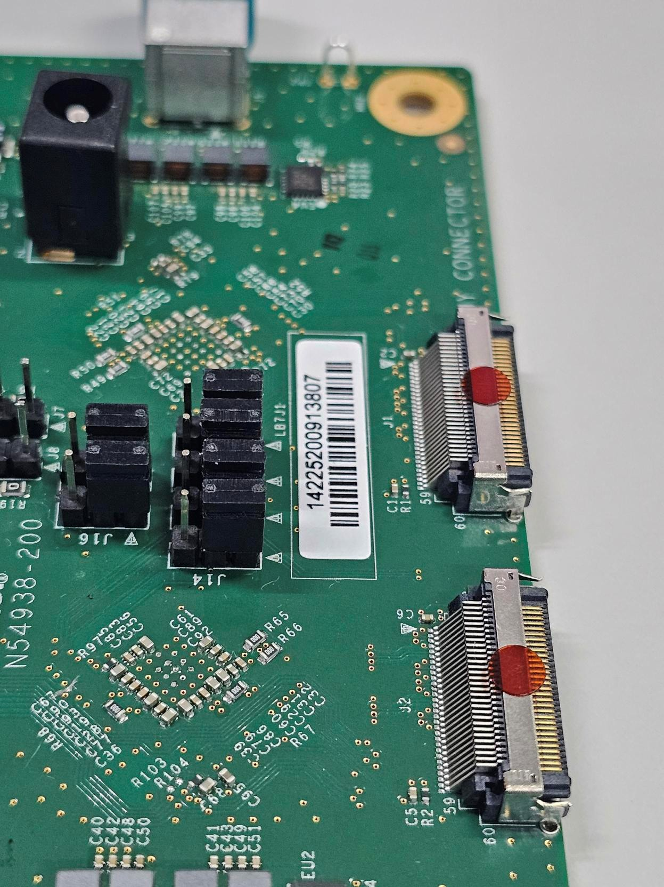
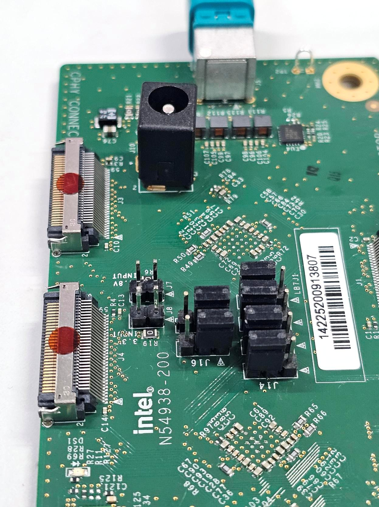

## Description

This document details the configuration settings for the ISX031 GMSL sensor, providing essential information for system integration. The table below presents the key parameters and their respective values used during system setup and validation.

## BIOS Configuration Table

> **Note:** No External Clock required.

#### Sensor ACPI HID

| Vendor                     | Sensor ACPI HID      |
|---                         |---                   |
| D3 Embedded                | INTC031M             |
| Leopard Imaging            | INTC031L             |
| Otobrite                   | INTC031O             |
| Sensing                    | INTC031S             |

#### IPU6EP Camera Option

|                            | Camera1 Link options | Camera2 Link Options |
|---                         |---                   | ---                  |
| Sensor Model               | User Custom          | User Custom          |
| Custom HID                 | <sensor_acpi_hid>    | <sensor_acpi_hid>    |
| Lanes Clock division       | 4 4 2 2              | 4 4 2 2              |
| CRD Version                | CRD-D                | CRD-D                |
| GPIO control               | No Control Logic     | No Control Logic     |
| Camera position            | Front                | Back                 |
| Flash Support              | Disabled             | Disabled             |
| Privacy LED                | Driver default       | Driver default       |
| Rotation                   | 90                   | 90                   |
| PPR Value                  | 2                    | 2                    |
| PPR Unit                   | 2                    | 2                    |
| Camera module name         | _                    | _                    |
| MIPI port                  | 1                    | 2                    |
| LaneUsed                   | x4                   | x4                   |
| MCLK                       | 19200000             | 19200000             |
| EEPROM Type                | ROM_NONE             | ROM_NONE             |
| VCM Type                   | VCM_NONE             | VCM_NONE             |
| Number of I2C Components   | 3                    | 3                    |
| I2C Channel                | I2C1                 | I2C0                 |
| Device 0                   |                      |                      |
| I2C Address                | 48                   | 48                   |
| Device Type                | Sensor               | Sensor               |
| Device 1                   |                      |                      |
| I2C Address                | 44                   | 44                   |
| Device Type                | Sensor               | Sensor               |
| Device 2                   |                      |                      |
| I2C Address                | 50                   | 50                   |
| Device Type                | Sensor               | Sensor               |
| Customize Device ID List   |                      |                      |
| Customize Device ID Number | 17                   | 17                   |
| Customize Device ID Number | 18                   | 18                   |
| Customize Device ID Number | 19                   | 19                   |
| Flash Driver Selection     | Disabled             | Disabled             |

#### IPU6EPMTL Camera Option

###### Connected to MAX9296 AIC

|                            | Camera1 Link options | Camera2 Link Options |
|---                         |---                   | ---                  |
| Sensor Model               | User Custom          | User Custom          |
| Custom HID                 | <sensor_acpi_hid>    | <sensor_acpi_hid>    |
| Lanes Clock division       | 4 4 2 2              | 4 4 2 2              |
| CRD Version                | CRD-D                | CRD-D                |
| GPIO control               | No Control Logic     | No Control Logic     |
| Camera position            | Front                | Back                 |
| Flash Support              | Disabled             | Disabled             |
| Privacy LED                | Driver default       | Driver default       |
| Rotation                   | 90                   | 90                   |
| PPR Value                  | 2                    | 2                    |
| PPR Unit                   | 2                    | 2                    |
| Camera module name         | _                    | _                    |
| MIPI port                  | 0                    | 4                    |
| LaneUsed                   | x4                   | x4                   |
| MCLK                       | 19200000             | 19200000             |
| EEPROM Type                | ROM_NONE             | ROM_NONE             |
| VCM Type                   | VCM_NONE             | VCM_NONE             |
| Number of I2C Components   | 3                    | 3                    |
| I2C Channel                | I2C1                 | I2C0                 |
| Device 0                   |                      |                      |
| I2C Address                | 48                   | 48                   |
| Device Type                | Sensor               | Sensor               |
| Device 1                   |                      |                      |
| I2C Address                | 44                   | 44                   |
| Device Type                | Sensor               | Sensor               |
| Device 2                   |                      |                      |
| I2C Address                | 50                   | 50                   |
| Device Type                | Sensor               | Sensor               |
| Customize Device ID List   |                      |                      |
| Customize Device ID Number | 17                   | 17                   |
| Customize Device ID Number | 18                   | 18                   |
| Customize Device ID Number | 19                   | 19                   |
| Flash Driver Selection     | Disabled             | Disabled             |

###### Connected to D-PHY of MAX96724 AIC

AIC jumper connections

Known issue: Only 2 lanes (PPR value of 2) supported. 4 lanes support WIP

|                            | Camera1 Link options | Camera2 Link Options |
|---                         |---                   | ---                  |
| Sensor Model               | User Custom          | User Custom          |
| Custom HID                 | <sensor_acpi_hid>    | <sensor_acpi_hid>    |
| Lanes Clock division       | 4 4 2 2              | 4 4 2 2              |
| CRD Version                | CRD-D                | CRD-D                |
| GPIO control               | No Control Logic     | No Control Logic     |
| Camera position            | Front                | Back                 |
| Flash Support              | Disabled             | Disabled             |
| Privacy LED                | Driver default       | Driver default       |
| Rotation                   | 0                    | 180                  |
| PPR Value                  | 2                    | 4                    |
| PPR Unit                   | 4                    | 4                    |
| Camera module name         | _                    | _                    |
| MIPI port                  | 0                    | 4                    |
| LaneUsed                   | x4                   | x4                   |
| MCLK                       | 19200000             | 19200000             |
| EEPROM Type                | ROM_NONE             | ROM_NONE             |
| VCM Type                   | VCM_NONE             | VCM_NONE             |
| Number of I2C Components   | 3                    | 3                    |
| I2C Channel                | I2C1                 | I2C0                 |
| Device 0                   |                      |                      |
| I2C Address                | 27                   | 27                   |
| Device Type                | Sensor               | Sensor               |
| Device 1                   |                      |                      |
| I2C Address                | 44                   | 44                   |
| Device Type                | Sensor               | Sensor               |
| Device 2                   |                      |                      |
| I2C Address                | 50                   | 50                   |
| Device Type                | Sensor               | Sensor               |
| Customize Device ID List   |                      |                      |
| Customize Device ID Number | 17                   | 17                   |
| Customize Device ID Number | 18                   | 18                   |
| Customize Device ID Number | 19                   | 19                   |
| Flash Driver Selection     | Disabled             | Disabled             |

#### IPU75XA Camera Link Options

###### Connected to C-PHY of MAX96724 AIC

AIC jumper connections

|                            | Camera1 Link options | Camera2 Link Options |
|---                         |---                   | ---                  |
| Sensor Model               | User Custom          | User Custom          |
| Custom HID                 | <sensor_acpi_hid>    | <sensor_acpi_hid>    |
| Lanes Clock division       | 4 4 2 2              | 4 4 2 2              |
| CRD Version                | CRD-D                | CRD-D                |
| GPIO control               | No Control Logic     | No Control Logic     |
| Camera position            | Front                | Back                 |
| Flash Support              | Disabled             | Disabled             |
| Privacy LED                | Driver default       | Driver default       |
| Rotation                   | 180                  | 0                    |
| Voltage Rail               |                      | 3 voltage rail       |
| PhyConfiguration           | CPHY                 | CPHY                 |
| PPR Value                  | 2                    | 2                    |
| PPR Unit                   | 4                    | 4                    |
| Camera module name         | _                    | _                    |
| MIPI port                  | 0                    | 2                    |
| LaneUsed                   | x4                   | x4                   |
| MCLK                       | 19200000             | 19200000             |
| EEPROM Type                | ROM_NONE             | ROM_NONE             |
| VCM Type                   | VCM_NONE             | VCM_NONE             |
| Number of I2C Components   | 3                    | 3                    |
| I2C Channel                | I2C1                 | I2C2                 |
| Device 0                   |                      |                      |
| I2C Address                | 27                   | 27                   |
| Device Type                | Sensor               | Sensor               |
| Device 1                   |                      |                      |
| I2C Address                | 44                   | 44                   |
| Device Type                | Sensor               | Sensor               |
| Device 2                   |                      |                      |
| I2C Address                | 54                   | 54                   |
| Device Type                | Sensor               | Sensor               |
| Customize Device ID List   |                      |                      |
| Customize Device ID Number | 17                   | 17                   |
| Customize Device ID Number | 18                   | 18                   |
| Customize Device ID Number | 19                   | 19                   |
| Flash Driver Selection     | Disabled             | Disabled             |

###### Connected to D-PHY of MAX96724 AIC (via C-to-D-PHY adaptor)

|                            | Camera1 Link options | Camera2 Link Options |
|---                         |---                   | ---                  |
| Sensor Model               | User Custom          | User Custom          |
| Custom HID                 | <sensor_acpi_hid>    | <sensor_acpi_hid>    |
| Lanes Clock division       | 4 4 2 2              | 4 4 2 2              |
| CRD Version                | CRD-D                | CRD-D                |
| GPIO control               | No Control Logic     | No Control Logic     |
| Camera position            | Front                | Back                 |
| Flash Support              | Disabled             | Disabled             |
| Privacy LED                | Driver default       | Driver default       |
| Rotation                   | 180                  | 0                    |
| Voltage Rail               |                      | 3 voltage rail       |
| PhyConfiguration           | DPHY                 | DPHY                 |
| PPR Value                  | 4                    | 2                    |
| PPR Unit                   | 4                    | 4                    |
| Camera module name         | _                    | _                    |
| MIPI port                  | 0                    | 2                    |
| LaneUsed                   | x4                   | x4                   |
| MCLK                       | 19200000             | 19200000             |
| EEPROM Type                | ROM_NONE             | ROM_NONE             |
| VCM Type                   | VCM_NONE             | VCM_NONE             |
| Number of I2C Components   | 3                    | 3                    |
| I2C Channel                | I2C1                 | I2C2                 |
| Device 0                   |                      |                      |
| I2C Address                | 27                   | 27                   |
| Device Type                | Sensor               | Sensor               |
| Device 1                   |                      |                      |
| I2C Address                | 44                   | 44                   |
| Device Type                | Sensor               | Sensor               |
| Device 2                   |                      |                      |
| I2C Address                | 54                   | 54                   |
| Device Type                | Sensor               | Sensor               |
| Customize Device ID List   |                      |                      |
| Customize Device ID Number | 17                   | 17                   |
| Customize Device ID Number | 18                   | 18                   |
| Customize Device ID Number | 19                   | 19                   |
| Flash Driver Selection     | Disabled             | Disabled             |

## Camera XML/JSON File Setup

#### IPU6EP Configuration

> **Note:** IPU6EP using same configuration as IPU6EPMTL.

Replace target system with recommended [ipu6ep](../../config/isx031/ipu6ep) setting

    sudo cp -r ../../config/isx031/ipu6ep /etc/camera

#### IPU6EPMTL Configuration

Replace target system with recommended [ipu6epmtl](../../config/isx031/ipu6epmtl) setting

    sudo cp -r ../../config/isx031/ipu6epimtl /etc/camera

#### IPU75XA Configuration

Replace target system with recommended [ipu75xa](../../config/isx031/ipu75xa) setting

    sudo cp -r ../../config/isx031/ipu75xa /etc/camera

## Sample Userspace Command

#### Sensor Device Selection

| Sensor Number | Command Pipeline |
|---|---|
| 1 | gst-launch-1.0 icamerasrc num-buffers=-1 num-vc=1 scene-mode=normal device-name=isx031-1 printfps=true io-mode=dma_mode ! 'video/x-raw(memory:DMABuf),drm-format=UYVY,width=1920,height=1536' ! glimagesink sync=false |
| 2 | gst-launch-1.0 icamerasrc num-buffers=-1 num-vc=1 scene-mode=normal device-name=isx031-2 printfps=true io-mode=dma_mode ! 'video/x-raw(memory:DMABuf),drm-format=UYVY,width=1920,height=1536' ! glimagesink sync=false |
| 3 | gst-launch-1.0 icamerasrc num-buffers=-1 num-vc=1 scene-mode=normal device-name=isx031-3 printfps=true io-mode=dma_mode ! 'video/x-raw(memory:DMABuf),drm-format=UYVY,width=1920,height=1536' ! glimagesink sync=false |
| 4 | gst-launch-1.0 icamerasrc num-buffers=-1 num-vc=1 scene-mode=normal device-name=isx031-4 printfps=true io-mode=dma_mode ! 'video/x-raw(memory:DMABuf),drm-format=UYVY,width=1920,height=1536' ! glimagesink sync=false |
| 5 | gst-launch-1.0 icamerasrc num-buffers=-1 num-vc=1 scene-mode=normal device-name=isx031-5 printfps=true io-mode=dma_mode ! 'video/x-raw(memory:DMABuf),drm-format=UYVY,width=1920,height=1536' ! glimagesink sync=false |
| 6 | gst-launch-1.0 icamerasrc num-buffers=-1 num-vc=1 scene-mode=normal device-name=isx031-6 printfps=true io-mode=dma_mode ! 'video/x-raw(memory:DMABuf),drm-format=UYVY,width=1920,height=1536' ! glimagesink sync=false |
| 7 | gst-launch-1.0 icamerasrc num-buffers=-1 num-vc=1 scene-mode=normal device-name=isx031-7 printfps=true io-mode=dma_mode ! 'video/x-raw(memory:DMABuf),drm-format=UYVY,width=1920,height=1536' ! glimagesink sync=false |
| 8 | gst-launch-1.0 icamerasrc num-buffers=-1 num-vc=1 scene-mode=normal device-name=isx031-8 printfps=true io-mode=dma_mode ! 'video/x-raw(memory:DMABuf),drm-format=UYVY,width=1920,height=1536' ! glimagesink sync=false |

> **Note**: Refer to icamerasrc device-name property for more sensor details.

#### Frame Buffer Memory Type (IO Mode) Selection

| IO Mode | Command Pipeline |
|---|---|
| MMAP | gst-launch-1.0 icamerasrc num-buffers=-1 num-vc=1 scene-mode=normal device-name=isx031-1 printfps=true io-mode=mmap ! 'video/x-raw,format=UYVY,width=1920,height=1536' ! glimagesink sync=false |
| DMA MODE | gst-launch-1.0 icamerasrc num-buffers=-1 num-vc=1 scene-mode=normal device-name=isx031-1 printfps=true io-mode=dma_mode ! 'video/x-raw(memory:DMABuf),drm-format=UYVY,width=1920,height=1536' ! glimagesink sync=false |

> **Note**: Refer to icamerasrc io-mode property for more sensor details.

#### Sensor Resolution Selection

| Resolution | Command Pipeline |
|---|---|
| 1920x1536 | gst-launch-1.0 icamerasrc num-buffers=-1 num-vc=1 scene-mode=normal device-name=isx031-1 printfps=true io-mode=dma_mode ! 'video/x-raw(memory:DMABuf),drm-format=UYVY,width=1920,height=1536' ! glimagesink sync=false |

#### Sensor Format Selection

| Format | Command Pipeline |
|---|---|
| UYVY | gst-launch-1.0 icamerasrc num-buffers=-1 num-vc=1 scene-mode=normal device-name=isx031-1 printfps=true io-mode=dma_mode ! 'video/x-raw(memory:DMABuf),drm-format=UYVY,width=1920,height=1536' ! glimagesink sync=false |

#### Number of Stream (Single Stream / Multi Stream) Selection

| Number of Stream | Command Pipeline |
|---|---|
| x1 | gst-launch-1.0 icamerasrc num-buffers=-1 num-vc=1 scene-mode=normal device-name=isx031-1 printfps=true io-mode=dma_mode ! 'video/x-raw(memory:DMABuf),drm-format=UYVY,width=1920,height=1536' ! glimagesink sync=false |
| x2 | gst-launch-1.0 icamerasrc num-buffers=-1 num-vc=2 scene-mode=normal device-name=isx031x2-1 printfps=true io-mode=dma_mode ! 'video/x-raw(memory:DMABuf),drm-format=UYVY,width=1920,height=1536' ! glimagesink sync=false icamerasrc num-buffers=-1 num-vc=2 scene-mode=normal device-name=isx031x2-2 printfps=true io-mode=dma_mode ! 'video/x-raw(memory:DMABuf),drm-format=UYVY,width=1920,height=1536' ! glimagesink sync=false |
| x4 | gst-launch-1.0 icamerasrc num-buffers=-1 num-vc=4 scene-mode=normal device-name=isx031x4-1 printfps=true io-mode=dma_mode ! 'video/x-raw(memory:DMABuf),drm-format=UYVY,width=1920,height=1536' ! glimagesink sync=false icamerasrc num-buffers=-1 num-vc=4 scene-mode=normal device-name=isx031x4-2 printfps=true io-mode=dma_mode ! 'video/x-raw(memory:DMABuf),drm-format=UYVY,width=1920,height=1536' ! glimagesink sync=false icamerasrc num-buffers=-1 num-vc=4 scene-mode=normal device-name=isx031x4-3 printfps=true io-mode=dma_mode ! 'video/x-raw(memory:DMABuf),drm-format=UYVY,width=1920,height=1536' ! glimagesink sync=false icamerasrc num-buffers=-1 num-vc=4 scene-mode=normal device-name=isx031x4-4 printfps=true io-mode=dma_mode ! 'video/x-raw(memory:DMABuf),drm-format=UYVY,width=1920,height=1536' ! glimagesink sync=false |
| x8 | gst-launch-1.0 icamerasrc num-buffers=-1 num-vc=8 scene-mode=normal device-name=isx031x8-1 printfps=true io-mode=dma_mode ! 'video/x-raw(memory:DMABuf),drm-format=UYVY,width=1920,height=1536' ! glimagesink sync=false icamerasrc num-buffers=-1 num-vc=8 scene-mode=normal device-name=isx031x8-2 printfps=true io-mode=dma_mode ! 'video/x-raw(memory:DMABuf),drm-format=UYVY,width=1920,height=1536' ! glimagesink sync=false icamerasrc num-buffers=-1 num-vc=8 scene-mode=normal device-name=isx031x8-3 printfps=true io-mode=dma_mode ! 'video/x-raw(memory:DMABuf),drm-format=UYVY,width=1920,height=1536' ! glimagesink sync=false icamerasrc num-buffers=-1 num-vc=8 scene-mode=normal device-name=isx031x8-4 printfps=true io-mode=dma_mode ! 'video/x-raw(memory:DMABuf),drm-format=UYVY,width=1920,height=1536' ! glimagesink sync=false icamerasrc num-buffers=-1 num-vc=8 scene-mode=normal device-name=isx031x8-5 printfps=true io-mode=dma_mode ! 'video/x-raw(memory:DMABuf),drm-format=UYVY,width=1920,height=1536' ! glimagesink sync=false icamerasrc num-buffers=-1 num-vc=8 scene-mode=normal device-name=isx031x8-6 printfps=true io-mode=dma_mode ! 'video/x-raw(memory:DMABuf),drm-format=UYVY,width=1920,height=1536' ! glimagesink sync=false icamerasrc num-buffers=-1 num-vc=8 scene-mode=normal device-name=isx031x8-7 printfps=true io-mode=dma_mode ! 'video/x-raw(memory:DMABuf),drm-format=UYVY,width=1920,height=1536' ! glimagesink sync=false icamerasrc num-buffers=-1 num-vc=8 scene-mode=normal device-name=isx031x8-8 printfps=true io-mode=dma_mode ! 'video/x-raw(memory:DMABuf),drm-format=UYVY,width=1920,height=1536' ! glimagesink sync=false |

#### FPS Result

| Number of Stream | IO Mode  | FPS Result |
|---               |---       |---         |
| x1               | MMAP     | 30         |
| x2               | MMAP     | 30         |
| x4               | MMAP     | 30         |
| x8               | MMAP     | 30         |
| x1               | DMA MODE | 30         |
| x2               | DMA MODE | 30         |
| x4               | DMA MODE | 30         |
| x8               | DMA MODE | 30         |

> **Note:** Please ensure your system enable support for specified  number of stream before test.
