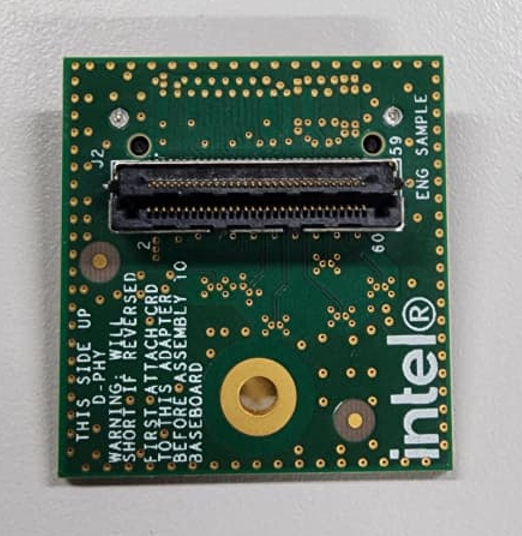
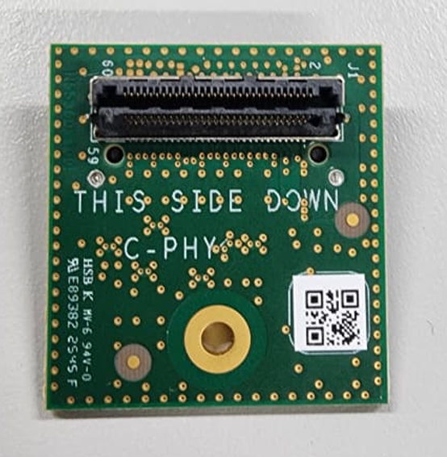

## Description

This document details the configuration settings for the OV13B10 MIPI CSI-2 sensor, providing essential information for system integration. The table below presents the key parameters and their respective values used during system setup and validation.

## BIOS Configuration Table

> **Note:** On Leopard Imaging HW, it is hardwired to use 24MHz External Clock on the adapter, instead of getting external clock from SOC.

### MIPI Camera Configuration for IPU75XA

Config path: `Intel Advanced Menu`->`System Agent (SA) Configuration`->`MIPI Camera Configuration`

|                            | Control Logic 1      | Control Logic 2      |
|---                         |---                   |---                   |
| Control Logic Type         | Discrete             | Discrete             |
| CRD Version                | CRD-D                | CRD-D                |
| Input Clock                | 19.2MHz              | 19.2MHz              |
| PCH Clock                  | IMGCLKOUT_0          | IMGCLKOUT_1          |
| Number of GPIOs            | 3                    | 3                    |
| GPIO Pin 0                 |                      |                      |
| Group Pad Number           | 10                   | 1                    |
| Group Number               | C_D_E_H              | C_D_E_H              |
| Com Number                 | COM1                 | COM1                 |
| Function                   | RESET                | RESET                |
| Active Value               | 1                    | 1                    |
| Initial Value              | 0                    | 0                    |
| GPIO Pin 1                 |                      |                      |
| Group Pad Number           | 5                    | 8                    |
| Group Number               | C_D_E_H              | C_D_E_H              |
| Com Number                 | COM0                 | COM0                 |
| Function                   | Power_En             | Power_En             |
| Active Value               | 1                    | 1                    |
| Initial Value              | 0                    | 0                    |
| GPIO Pin 2                 |                      |                      |
| Group Pad Number           | 20                   | 19                   |
| Group Number               | B_F_S_V              | B_F_S_V              |
| Com Number                 | COM1                 | COM1                 |
| Function                   | pLED_En              | pLED_En              |
| Active Value               | 1                    | 1                    |
| Initial Value              | 0                    | 0                    |

|                            | Camera1 Link options | Camera2 Link Options |
|---                         |---                   | ---                  |
| Sensor Model               | OV13B                | OV13B                |
| Lanes Clock division       | 4 4 2 2              | 4 4 2 2              |
| CRD Version                | CRD-D                | CRD-D                |
| GPIO control               | Control Logic 1      | Control Logic 2      |
| Camera position            | Back                 | Front                |
| Flash Support              | Enabled              | Enabled              |
| Privacy LED                | Driver default       | Driver default       |
| Rotation                   | 0                    | 0                    |
| Voltage Rail               |                      | 3 voltage rail       |
| PhyConfiguration           | DPHY                 | DPHY                 |
| LaneConfiguration          | 0                    | 0                    |
| Camera module name         | 09B13                | 09B13                |
| MIPI port                  | 0                    | 2                    |
| LaneUsed                   | x4                   | x2                   |
| MCLK                       | 19200000             | 19200000             |
| EEPROM Type                | ROM_EEPROM_BRCA016GWZ| ROM_EEPROM_BRCA016GWZ|
| VCM Type                   | VCM_DW9714           | VCM_DW9714           |
| Number of I2C Components   | 7                    | 7                    |
| I2C Channel                | I2C1                 | I2C0                 |
| Device 0                   |                      |                      |
| I2C Address                | 10                   | 10                   |
| Device Type                | Sensor               | Sensor               |
| Device 1                   |                      |                      |
| I2C Address                | C                    | C                    |
| Device Type                | VCM                  | VCM                  |
| Device 2                   |                      |                      |
| I2C Address                | 50                   | 50                   |
| Device Type                | EEPROM               | EEPROM               |
| Device 3                   |                      |                      |
| I2C Address                | 51                   | 51                   |
| Device Type                | EEPROM_EXT1          | EEPROM_EXT1          |
| Device 4                   |                      |                      |
| I2C Address                | 52                   | 52                   |
| Device Type                | EEPROM_EXT2          | EEPROM_EXT2          |
| Device 5                   |                      |                      |
| I2C Address                | 53                   | 53                   |
| Device Type                | EEPROM_EXT3          | EEPROM_EXT3          |
| Device 6                   |                      |                      |
| I2C Address                | 54                   | 54                   |
| Device Type                | EEPROM_EXT4          | EEPROM_EXT4          |
| Customize Device ID List   |                      |                      |
| Customize Device ID Number | 17                   | 17                   |
| Customize Device ID Number | 18                   | 18                   |
| Customize Device ID Number | 19                   | 19                   |
| Flash Driver Selection     | Disabled             | Disabled             |

### MIPI Camera Configuration for IPU8

Config path: `Intel Advanced Menu`->`System Agent (SA) Configuration`->`MIPI Camera Configuration`

|                            | Control Logic 1      | Control Logic 2      |
|---                         |---                   |---                   |
| Control Logic Type         | Discrete             | Discrete             |
| CRD Version                | CRD-D                | CRD-D                |
| Input Clock                | 19.2MHz              | 19.2MHz              |
| PCH Clock                  | IMGCLKOUT_0          | IMGCLKOUT_1          |
| Number of GPIOs            | 2                    | 3                    |
| GPIO Pin 0                 |                      |                      |
| Group Pad Number           | 10                   | 11                   |
| Group Number               | C_E_V                | B_D_F_S              |
| Com Number                 | COM1                 | COM1                 |
| Function                   | RESET                | RESET                |
| Active Value               | 1                    | 1                    |
| Initial Value              | 0                    | 0                    |
| GPIO Pin 1                 |                      |                      |
| Group Pad Number           | 5                    | 8                    |
| Group Number               | C_E_V                | C_E_V                |
| Com Number                 | COM0                 | COM0                 |
| Function                   | Power_En             | Power_En             |
| Active Value               | 1                    | 1                    |
| Initial Value              | 0                    | 0                    |
| GPIO Pin 2                 |                      |                      |
| Group Pad Number           |                      | 19                   |
| Group Number               |                      | B_D_F_S              |
| Com Number                 |                      | COM1                 |
| Function                   |                      | pLED_En              |
| Active Value               |                      | 1                    |
| Initial Value              |                      | 0                    |

|                            | Camera1 Link options | Camera2 Link Options |
|---                         |---                   | ---                  |
| Sensor Model               | OV13B                | OV13B                |
| Lanes Clock division       | 4 4 2 2              | 4 4 2 2              |
| CRD Version                | CRD-D                | CRD-D                |
| GPIO control               | Control Logic 1      | Control Logic 2      |
| Camera position            | Front                | Back                 |
| Flash Support              | Enabled              | Enabled              |
| Privacy LED                | Driver default       | Driver default       |
| Rotation                   | 0                    | 0                    |
| Voltage Rail               |                      | 3 voltage rail       |
| PhyConfiguration           | DPHY                 | DPHY                 |
| LaneConfiguration          | 0                    | 0                    |
| Camera module name         | KBAG152W             | _                    |
| MIPI port                  | 0                    | 2                    |
| LaneUsed                   | x4                   | x2                   |
| MCLK                       | 19200000             | 19200000             |
| EEPROM Type                | ROM_EEPROM_GT24P64E  | ROM_EEPROM_GT24P64E  |
| VCM Type                   | VCM_DW9714           | VCM_DW9714           |
| Number of I2C Components   | 3                    | 3                    |
| I2C Channel                | I2C1                 | I2C0                 |
| Device 0                   |                      |                      |
| I2C Address                | 10                   | 10                   |
| Device Type                | Sensor               | Sensor               |
| Device 1                   |                      |                      |
| I2C Address                | C                    | C                    |
| Device Type                | VCM                  | VCM                  |
| Device 2                   |                      |                      |
| I2C Address                | 50                   | 50                   |
| Device Type                | EEPROM               | EEPROM               |
| Customize Device ID List   |                      |                      |
| Customize Device ID Number | 17                   | 17                   |
| Customize Device ID Number | 18                   | 18                   |
| Customize Device ID Number | 19                   | 19                   |
| Flash Driver Selection     | Disabled             | Disabled             |

> **Note:** CPHY-DPHY adapter board required only if connecting a DPHY sensor to CPHY MIPI.

DPHY sensor must be connecting to the front side of adapter.

Connect the rear side of adapter to CPHY MIPI.

## Camera Configuration File Setup
By Default, all the config file is already included in ipu7-camera-hal repository

## Environment Setup

Export environment variables below

    unset XDG_RUNTIME_DIR
    export DISPLAY=:0; xhost +
    export GST_PLUGIN_PATH=/usr/lib/gstreamer-1.0
    export LIBVA_DRIVER_NAME=iHD
    export GST_GL_API=gles2
    export GST_GL_PLATFORM=egl
    export LIBVA_DRIVERS_PATH=/usr/lib/x86_64-linux-gnu/dri
    export PKG_CONFIG_PATH=/usr/local/lib/pkgconfig:/usr/lib64/pkgconfig:/usr/lib/pkgconfig
    export LD_LIBRARY_PATH=/usr/local/lib/pkgconfig:/usr/local/lib:/usr/lib64:/usr/lib:/usr/lib/x86_64-linux-gnu
    export logSink=terminal
    rm -rf ~/.cache/gstreamer-1.0

## Sensor Verification

Upon setup completion, verify sensor with:

    media-ctl -p

## Sample Userspace Command

#### Sensor Device Selection

| MIPI Port | Command Pipeline |
|---|---|
| CRD1 | gst-launch-1.0 icamerasrc num-buffers=-1 scene-mode=normal device-name=ov13b10-wf printfps=true io-mode=dma_mode ! 'video/x-raw(memory:DMABuf),drm-format=NV12,width=1280,height=960' ! glimagesink sync=false |
| CRD2 | gst-launch-1.0 icamerasrc num-buffers=-1 scene-mode=normal device-name=ov13b10-uf printfps=true io-mode=dma_mode ! 'video/x-raw(memory:DMABuf),drm-format=NV12,width=1280,height=960' ! glimagesink sync=false |

**Note**: Refer to icamerasrc device-name property for more sensor details.

#### Frame Buffer Memory Type (IO Mode) Selection

| IO Mode | Command Pipeline |
|---|---|
| DMA MODE | gst-launch-1.0 icamerasrc num-buffers=-1 scene-mode=normal device-name=ov13b10-wf printfps=true io-mode=dma_mode ! 'video/x-raw(memory:DMABuf),drm-format=NV12,width=1280,height=960' ! glimagesink sync=false |

**Note**: Refer to icamerasrc io-mode property for more sensor details.

#### Sensor Resolution Selection

| Resolution | Command Pipeline |
|---|---|
| 1280x960 | gst-launch-1.0 icamerasrc num-buffers=-1 scene-mode=normal device-name=ov13b10-wf printfps=true io-mode=dma_mode ! 'video/x-raw(memory:DMABuf),drm-format=NV12,width=1280,height=960' ! glimagesink sync=false |

#### Sensor Format Selection

| Format | Command Pipeline |
|---|---|
| NV12 | gst-launch-1.0 icamerasrc num-buffers=-1 scene-mode=normal device-name=ov13b10-wf printfps=true io-mode=dma_mode ! 'video/x-raw(memory:DMABuf),drm-format=NV12,width=1280,height=960' ! glimagesink sync=false |

#### Number of Stream (Single Stream / Multi Stream) Selection

| Number of Stream | Command Pipeline |
|---|---|
| x1 | gst-launch-1.0 icamerasrc num-buffers=-1 scene-mode=normal device-name=ov13b10-wf printfps=true io-mode=dma_mode ! 'video/x-raw(memory:DMABuf),drm-format=NV12,width=1280,height=960' ! glimagesink sync=false |
| x2 | gst-launch-1.0 icamerasrc num-buffers=-1 scene-mode=normal device-name=ov13b10-wf printfps=true io-mode=dma_mode ! 'video/x-raw(memory:DMABuf),drm-format=NV12,width=1280,height=960' ! glimagesink sync=false icamerasrc num-buffers=-1 scene-mode=normal device-name=ov13b10-uf printfps=true io-mode=dma_mode ! 'video/x-raw(memory:DMABuf),drm-format=NV12,width=1280,height=960' ! glimagesink sync=false |

## Streaming Result

| Number of Stream | IO Mode  | FPS Result |
|---               |---       |---         |
| x1               | DMA MODE | 37         |
| x2               | DMA MODE | 37         |
